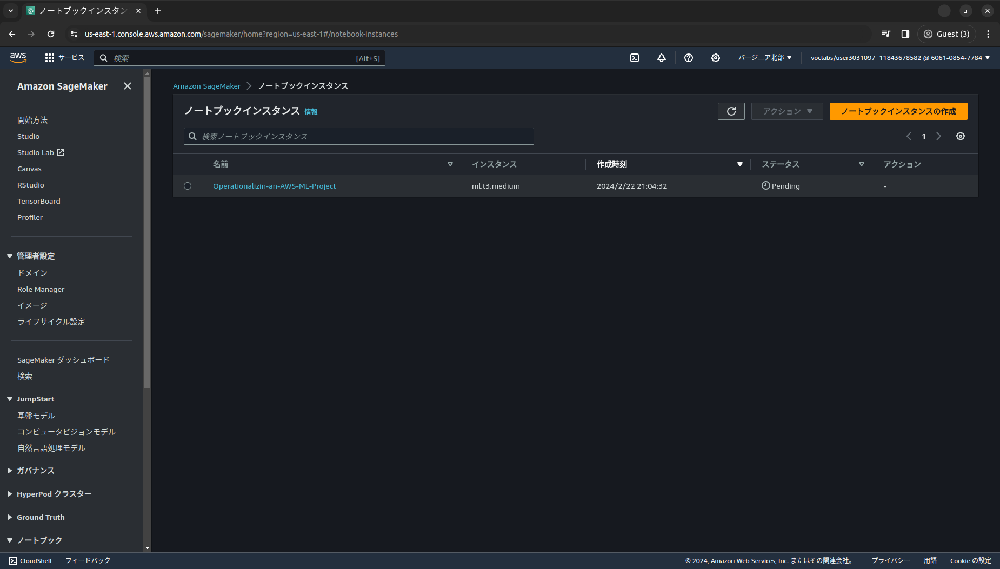
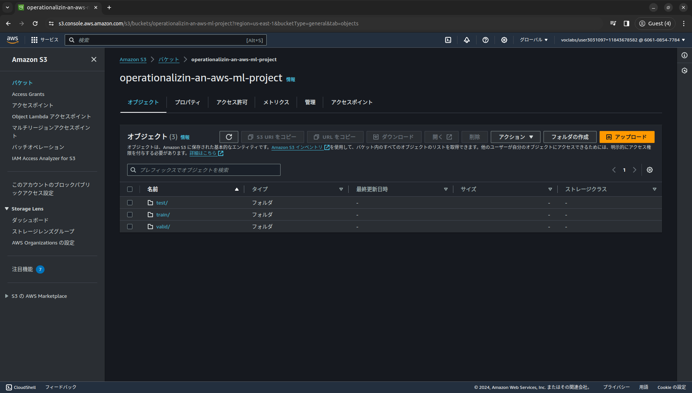
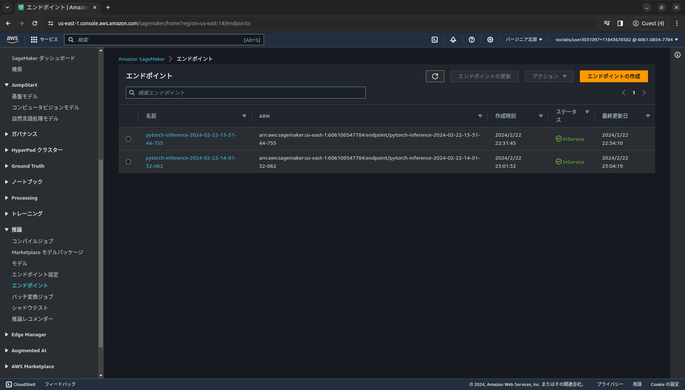
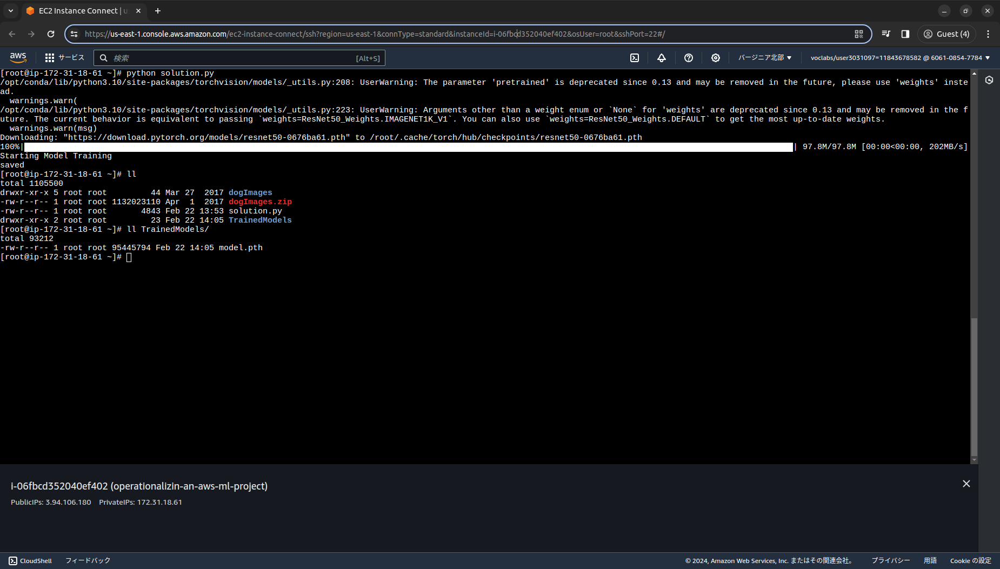
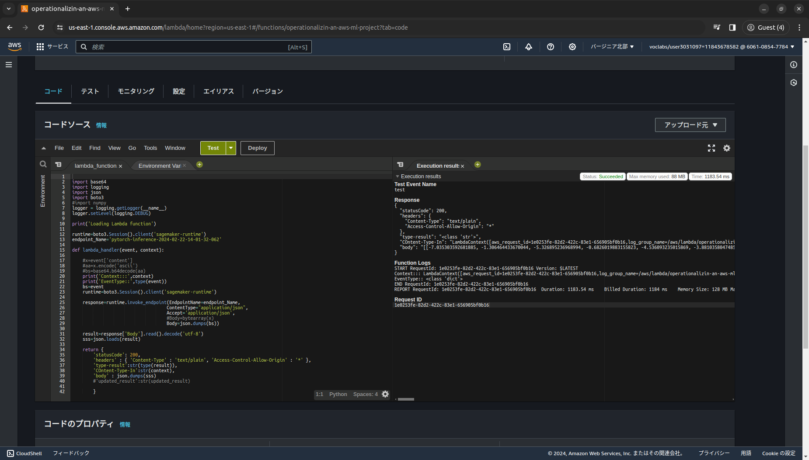
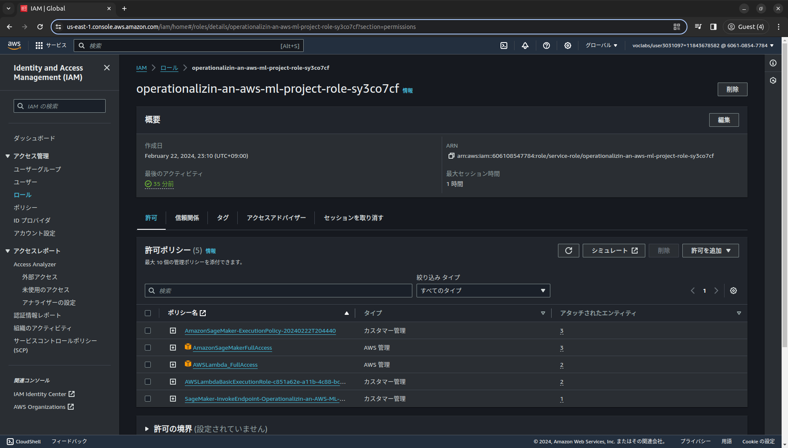

# Project: Operationalizing an AWS ML Project

## Training and deployment

Student sets up a Sagemaker instance: 


Student justifies the type of Sagemaker instance they created: __ml.t3.medium__ was created as it is sufficient to run my notebook.

Student creates an S3 bucket for data downloads: 


Student deploys an endpoint by running all starter notebooks: 



Student accomplishes multi-instance training: [Jupyter-Notebook](./train_and_deploy-solution.ipynb)

## EC2 Training

Create and open an EC2 instance: __m5.xlarge__ with __Deep Learning AMI GPU PyTorch 2.1.0__ was selected due to its low cost.


Train and save the classification model on EC2: [Python Script](./ec2train1.py)


## Lambda function setup

Lambda function invokes the student's deployed endpoint: 



Lambda function return statement follows best practices for API return statements


## Security and testing

Attach a security policy to the role associated with the Lambda endpoint : 


Test the Lambda function by invoking the endpoint with the "lab.jpg" input : 
```
{
  "statusCode": 200,
  "headers": {
    "Content-Type": "text/plain",
    "Access-Control-Allow-Origin": "*"
  },
  "type-result": "<class 'str'>",
  "COntent-Type-In": "LambdaContext([aws_request_id=8ce7215c-f463-4003-a8e8-2eb52971c02e,log_group_name=/aws/lambda/project-4,log_stream_name=2023/04/12/[$LATEST]779f63f6e8f74c13a51970470403d45d,function_name=project-4,memory_limit_in_mb=128,function_version=$LATEST,invoked_function_arn=arn:aws:lambda:us-east-1:271564095025:function:project-4,client_context=None,identity=CognitoIdentity([cognito_identity_id=None,cognito_identity_pool_id=None])])",
  "body": "[[-1.4969292879104614, -2.295322895050049, 1.7711918354034424, 1.7000603675842285, -2.9478816986083984, -2.8578217029571533, -4.275012493133545, -0.1858823001384735, -7.876079559326172, 3.485708713531494, 1.0156581401824951, -5.376102924346924, 0.08712732791900635, 1.043073058128357, -6.567814350128174, -4.29003381729126, -6.980752468109131, 0.8602855205535889, -1.9477488994598389, 3.517031192779541, 1.1386747360229492, 2.9857466220855713, -7.429625034332275, -4.872533321380615, -6.990846633911133, -6.551341533660889, -2.713444471359253, -7.38569974899292, -4.197381973266602, 0.5921437740325928, -0.23152270913124084, -1.7627674341201782, -4.5388617515563965, 0.545304000377655, -3.987135171890259, -3.03073787689209, -3.0044939517974854, -0.24150973558425903, 1.3483713865280151, -1.685007095336914, -1.484816312789917, 1.8437116146087646, 3.838435649871826, 0.6947075128555298, -0.1137256920337677, -11.679482460021973, 1.3911057710647583, -1.805575966835022, -2.34354567527771, 1.7085063457489014, -0.9614053964614868, -8.280823707580566, -7.071294784545898, 0.16166920959949493, -0.5199874639511108, -0.843184232711792, -6.246165752410889, -2.350785732269287, -1.3200641870498657, -2.318167209625244, -4.5581793785095215, -8.424875259399414, -7.389919281005859, -8.225934028625488, -5.960506916046143, -6.004213333129883, 3.052112102508545, -0.9716691374778748, 0.1721428632736206, 1.1353175640106201, 5.675631046295166, -4.881450176239014, -4.949894428253174, -4.2738471031188965, -1.0440956354141235, 0.615058183670044, -7.484931468963623, -3.1543450355529785, -4.828455448150635, -7.795574188232422, 2.6574225425720215, -8.622648239135742, 1.655287504196167, 1.2484384775161743, -8.302145957946777, -3.6932826042175293, 2.7479288578033447, -7.128697395324707, 1.1833446025848389, 2.0749804973602295, -8.263742446899414, -2.6031601428985596, -2.9580190181732178, -6.628727436065674, -2.2038745880126953, 0.8574008941650391, 0.36140191555023193, 1.240427851676941, -6.453752517700195, -9.306218147277832, -5.975752353668213, -0.851379930973053, -3.8800625801086426, -4.767630577087402, -2.8386266231536865, -5.776670932769775, -1.417716383934021, 2.4901983737945557, 1.7963000535964966, 0.9240027666091919, 1.3527525663375854, 1.043146014213562, -5.193169116973877, -2.356482982635498, -7.384207248687744, -0.1713782399892807, -4.5393853187561035, -2.649200916290283, -4.741747856140137, 0.618251621723175, 0.2919156551361084, -3.7748732566833496, -3.141923666000366, -1.8757330179214478, -6.020362377166748, -5.679347991943359, -1.4780714511871338, 1.1916701793670654, -4.358892917633057, -7.019332408905029, -5.486293792724609, 3.572416067123413, -3.9262099266052246]]"
}
```

Student identified potential vulnerabilities in the project's IAM configuration : 

Roles with "FullAccess" Policies: Roles that are granted "FullAccess" policies pose a significant security risk as they grant unrestricted access to resources and services within the system. These roles essentially provide overly broad permissions, which can lead to unauthorized access, data breaches, or even system compromise if exploited by malicious actors.


## Concurrency and auto-scaling

Student clearly describes the configuration of concurrency (on the Lambda function) and auto-scaling (for the deployed endpoint)

In AWS, effective concurrency and auto-scaling configurations are vital for performance and cost efficiency. This overview delves into configuring both for Lambda functions and deployed endpoints, alongside traffic, cost, and efficiency considerations.

### Concurrency (Lambda Function):
   - Set maximum simultaneous executions.
   - Use AWS Console or CLI.
   - Consider reserved concurrency for precise control.
### Auto-scaling (Deployed Endpoint):
   - Utilize services like EC2 Auto Scaling or Elastic Beanstalk.
   - Define scaling policies and integrate with CloudWatch.
   - Considerations:

### Traffic:
  - Analyze patterns and adjust configurations accordingly.
### Cost:
  - Balance performance with cost by selecting appropriate instances and optimizing configurations.
### Efficiency:
  - Optimize resource usage through controls like serverless computing and load balancing.

Optimizing concurrency and auto-scaling in AWS enhances performance, saves costs, and maximizes resource utilization. Regular monitoring and adjustment ensure continued efficiency.


